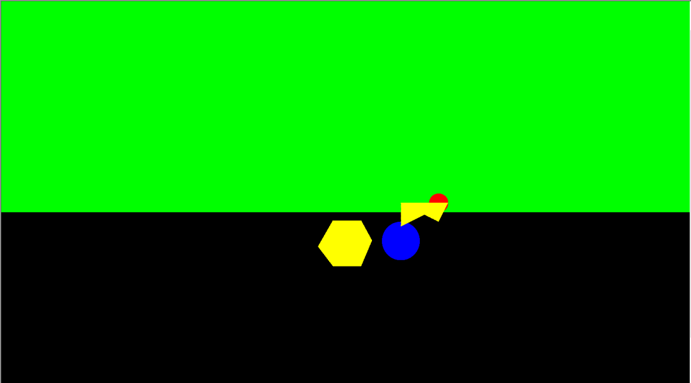
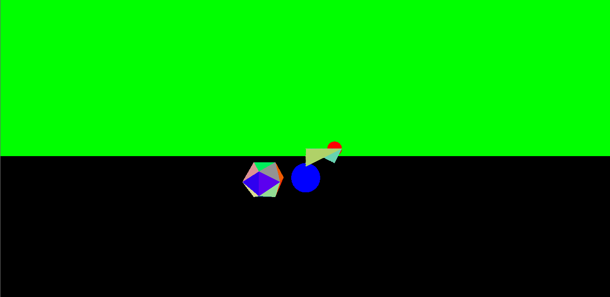
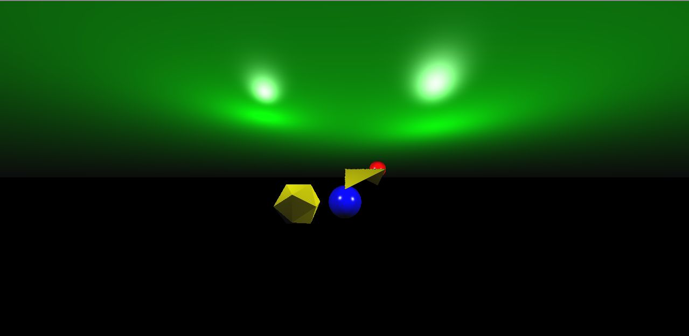
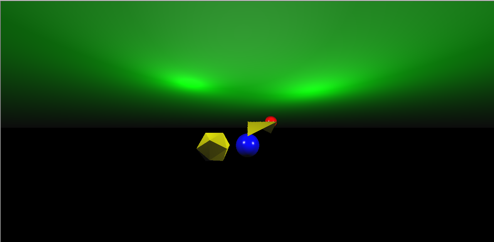
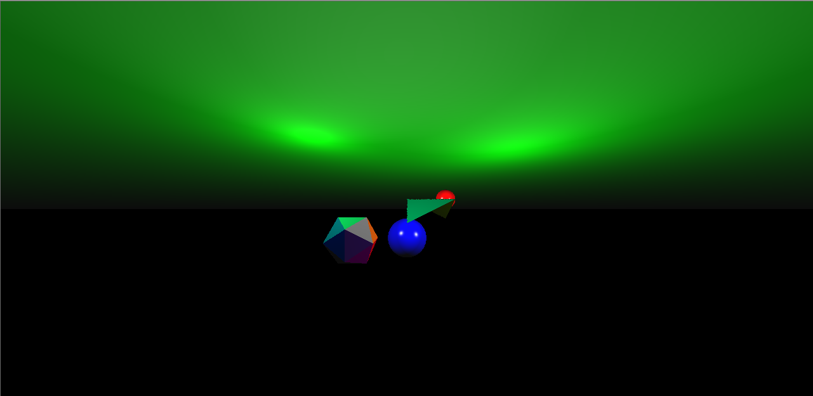

# PG
Repositório para desenvolvimento do projeto da disciplina de processamento gráfico do curso de ciência da computação

## Link de instalação do MingW

[Compilador Cpp](https://sourceforge.net/projects/gcc-win64/) 

## Biblioteca externa (GLM - Open Gl Mathematics)

Neste projeto usaremos a biblioteca externa GLM para as definições matemáticas necessárias.<br>
[Bilbioteca GLM documentação](https://github.com/g-truc/glm)

## Comandos úteis

### Comandos para compilar o código c++:

Os códigos abaixo não funcionam no powershell

```bash
// um arquivo apenas
g++ ./nome_arquivo.cpp -o nome_arquivo

// arquivo principal com headers
g++ ./nome_arquivo.cpp ./outro_arquivo.cpp -o nome_arquivo

// arquivo principal com headers em outras pastas
g++ ./nome_arquivo.cpp ./caminhoDaOutraPasta/*.cpp -o nome_arquivo
```

Estando dentro do diretório "Projeto" esses são os comandos mais atuais para rodar o código :

```bash
g++ ./main.cpp ./Includes/*.cpp ./Tools/*.cpp -o main.exe
./main.exe > main.ppm
```

após isso é apenas necessário abrir o arquivo .ppm gerado.

### Comando para gerar o arquivo .ppm linux (ou git bash no windows):

```bash
./filename.out > output.ppm
```

### ou no Windows :

```bash
Opcão : cmd (recomendável)
file_name.exe > output.ppm
```

## Como visualizar arquivos .ppm

No windows o visualizador de fotos padrão não suporta visualização de arquivos .ppm então duas recomendações de aplicativos de terceiros para visualizar esses arquivos são :

1 - [IrfanView](https://www.irfanview.com/)

2 - [XnView](https://www.xnview.com/en/)

## Resultados

Esta sessão é destinada a mostrar os resultados de implementação do raycaster e também em seguida o raytracer.

Após implementação do raycaster e de reconhecimento de objetos simples, criando os mesmos e gerando uma cena podemos visualizar imagens como esta:



Para visualizar melhor as malhas de triagulo substituimos os valores de cor pela normal de cada triângulo da malha:



Mas estas são imagens bem simples e com pouca complexidade de visualização, por isso para gerar imagens com mais detalhes e objetos com diferentes materiais como glossy e matte aplicamos a fórmula de [phong](https://en.wikipedia.org/wiki/Phong_reflection_model) para gerar imagens como essas:








